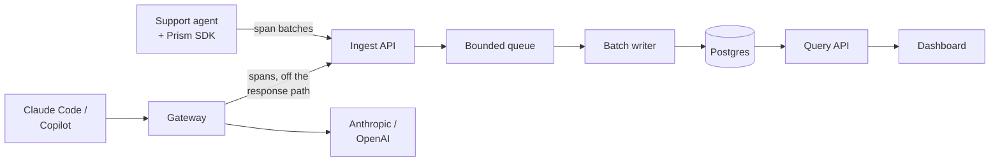

# Prism — PRD v1

Sep 25, 2026 · @Pavan

## Summary

Prism records every LLM call an agent makes and shows it as a live trace with tokens, latency, cost and guardrail events. v1 is a portfolio project: its job is to convince interviewers that its builder can design and ship real systems.

The problem it solves: teams running LLM agents can't see what an agent actually did, what each step cost, or where it failed. Coding assistants like Claude Code and GitHub Copilot are an even blacker box.

Prism connects two ways:

- **SDK mode (Python):** custom agents wrap their Anthropic or OpenAI client in one line and every call is traced.
- **Gateway mode:** Claude Code and Copilot point their API base URL at Prism, which forwards traffic to the provider and records it on the way through.

## Audience and success

The audience is interviewers: hiring managers and senior engineers in system-design rounds. They should walk away thinking "this person designs real systems, ships working software, and can explain the trade-offs."

Two moments must be flawless:

1. **Live waterfall:** a custom agent runs and its trace draws live, step by step, with cost per call.
2. **Coding assistants traced:** a Claude Code or Copilot session appears in Prism with tokens and cost per turn.

v1 is done when:

- Both moments work end to end, live on a laptop and as seeded data on the hosted demo.
- A reviewer can clone the repo and see the dashboard with demo data via `make demo` in under 10 minutes.
- The README explains the architecture and key trade-offs in a 5-minute read.
- A demo video of 3 minutes or less shows both moments.

## v1 scope

v1 covers both connection modes, a six-page dashboard, simple guardrails and failover, a CI eval gate, and a read-only hosted demo.

| Area | What v1 includes |
| --- | --- |
| SDK mode | Python. Wraps Anthropic and OpenAI clients: sync, async, streaming and tool use. `trace()` groups a run, `@span` marks tool steps. A background exporter batches spans and never blocks or crashes the host agent. |
| Gateway mode | Anthropic Messages and OpenAI Chat Completions endpoints with streaming passed through unchanged. Clients on day one: Claude Code, Copilot Chat in VS Code, Copilot CLI. Client API keys are forwarded, never stored or logged. |
| Dashboard | Traces list, trace detail (waterfall and span inspector), Costs, Gateway live feed, Guardrails, Evals. Clean and minimal, Linear-style, light and dark themes. |
| Guardrails | Redacts API keys, emails and card numbers before storage. Blocks prompts that match rules you configure (keywords, patterns). Budgets alert by default; hard stop only for SDK agents, never mid-session in Claude Code. |
| Failover | On 429 or 5xx for non-streamed requests: retry, then fall back to another model from the same provider. Recorded as an event on the trace. |
| Eval gate | `prism eval` runs saved prompt cases against a baseline and fails on regression. Sample GitHub Action included. |
| Hosted demo | Read-only dashboard over realistic seeded data, on GCP. |
| Docs | README with architecture diagram and trade-offs, usage guides per mode, a video of 3 minutes or less. |

## Non-goals for v1

These are deliberately out, to protect the two must-have moments:

- Visitors connecting their own agents to the hosted demo (possible later)
- Sign-in, user accounts and multi-tenant data isolation
- Switching providers on failover (for example Claude to OpenAI), which would need Prism to hold API keys
- AI-judged guardrails; v1 uses rules only
- SDKs for languages other than Python
- Copilot inline completions, which don't route through custom endpoints
- Tracking the cost of the sessions that built Prism

## Demo agent and script

The demo agent is a customer-support agent for a fictional store, with three tools over fake data: `lookup_order`, `issue_refund` and `draft_email`. Fake data keeps runs free, repeatable and never flaky, and one conversation exercises tool calls, redaction, a guardrail block and a budget alert.

The 5-minute script:

1. **0:00 Overview.** The dashboard shows a week of traffic; the Costs page shows spend by model.
2. **0:30 Live waterfall.** Run the agent with "Where's order 1042? I want a refund." The trace draws live: model call, `lookup_order`, model call, `issue_refund`, `draft_email`.
3. **1:30 Inspect.** Click a span to see tokens, cost and latency. The customer's email address shows as redacted.
4. **2:00 Guardrail.** Ask for a refund over the limit. A rule blocks it, and the block appears as its own span.
5. **2:30 Budget.** The agent crosses its budget and an alert fires.
6. **3:00 Coding assistants.** Point Claude Code at the gateway with one environment variable and ask a question. The session appears live with tokens and cost per turn. Repeat with Copilot Chat.
7. **4:00 Failover.** Simulate the primary model failing. The request still succeeds on the fallback model, and the trace shows the switch.
8. **4:30 Eval gate.** Open a PR that breaks a prompt. `prism eval` fails the CI check.

On the hosted read-only demo, steps 1, 3 and 5 are browsable as seeded data; the video covers the live steps.

## Architecture

Both modes feed one ingestion pipeline, and the dashboard reads from a single query API.



The SDK and gateway both emit spans; the queue decouples accepting spans from writing them.

### Engineering depth to showcase

- **Streaming correctness.** The gateway passes each streamed chunk through as it arrives and never buffers the response. Recording happens off the response path. Tests assert the client receives byte-identical output; target added latency under 10 ms at p95.
- **High-volume ingestion.** The SDK batches spans. The ingest API accepts batches and enqueues them; a background writer drains the queue with bulk inserts. When the queue is full, ingest returns 429 and the SDK drops the oldest spans with a counter, so a traced agent is never slowed down. Target: 1,000 spans per second on a laptop, shown with a load test.
- **OpenTelemetry-shaped traces (bonus).** Spans carry trace and span IDs, parent links and attributes named after the OpenTelemetry GenAI conventions where they fit, so an OTel exporter can be added later without a schema change.

The v1 queue is in-process, behind an interface, so Redis or Kafka can slot in later. The README explains that trade-off.

### Stack

Python 3.12 and FastAPI for the SDK, gateway and APIs; Postgres; React with TypeScript and Vite for the dashboard; docker compose for local runs; GitHub Actions for CI.

### Hosting

The hosted demo goes on Google Cloud, the cheapest of the three to start and keep running:

| Cloud | Sign-up credit | Stays free after the credit |
| --- | --- | --- |
| Google Cloud | $300 for 90 days | Cloud Run 2 million requests a month; one e2-micro VM in us-west1, us-central1 or us-east1 |
| AWS | Up to $200 over 6 months | Lambda 1 million requests a month; no free VM once credits end |
| Azure | $200 for 30 days | Free VMs for 12 months only |

Plan: the API and dashboard run on Cloud Run, which scales to zero when idle. Everything stays in a free-tier US region. Source: [cloud free-tier comparison](https://www.alekseialeinikov.com/en/blog/topics/cloud/aws-vs-google-cloud-vs-azure-free-tier), published Sep 24, 2026.

## Milestones

Five milestones over about four weeks at 20+ hours a week. Each ends at a checkpoint where the build stops, shows what works, and waits for approval.

| Milestone | Timing | Delivers | Done when |
| --- | --- | --- | --- |
| M0 Foundations | Days 1–3 | Repo, docker compose, span schema and API contract, sample data, design tokens, dashboard shell on sample data, CI | `make dev` shows the dashboard on sample data; `make check` passes in CI |
| M1 SDK and live waterfall | Week 1 | SDK for Anthropic and OpenAI, ingest pipeline with queue, Traces list, trace detail, the support agent | A support-agent run appears as a live waterfall within 2 seconds, with cost per call (must-have 1) |
| M2 Gateway | Week 2 | Anthropic and OpenAI routes with streaming, Gateway page, simple failover | Claude Code, Copilot Chat and Copilot CLI sessions appear with tokens and cost per turn; streaming tests pass (must-have 2) |
| M3 Guardrails, costs, evals | Week 3 | Redaction, rule-based blocking, budget alerts, Costs, Guardrails and Evals pages, `prism eval` and GitHub Action | Demo script steps 3, 4, 5 and 8 work end to end |
| M4 Ship | Week 4 | Seed data, read-only hosted demo on GCP, README, usage docs, video, load test | Hosted demo is live; README, docs and video are published; ingestion hits the target |

At each checkpoint the builder reports: what works, how to run and see it, what's stubbed, and any decisions needed. Nothing moves to the next milestone without approval.

## Decisions and open questions

| Decision | Choice | Why |
| --- | --- | --- |
| Audience | Interviewers | Portfolio project; judged on design and trade-offs |
| Must-have moments | Live waterfall; coding-assistant sessions with cost | Most visual, most distinctive |
| Gateway clients | Claude Code, Copilot Chat, Copilot CLI | All three on day one |
| SDK language | Python only | Enough for v1 |
| Hosted demo | Read-only seeded data | No sign-in or key handling needed |
| Failover | Retry, then same-provider model fallback | Simple; no Prism-held keys |
| Guardrails | Redaction, rule-based blocking, budget alerts | Predictable, no added latency |
| Engineering depth | Streaming correctness, high-volume ingestion, OTel-shaped spans | Strongest interview talking points |
| Demo agent | Customer support with fake-data tools | Free, repeatable, shows every feature |
| Look | Clean and minimal, Linear-style | Business choice |
| Hosting | Google Cloud | Largest credit, permanent free allowance |
| Demo delivery | README, docs, usage guides, short video | Business choice |
| Build-cost tracking | Not included | Business choice |
| Pace | 20+ hours a week, about four weeks | Business choice |

Open questions (answer by the milestone shown):

- [ ] Repo name, and public on GitHub from day one? (M0)
- [ ] Refund limit and default budget for the demo, for example $200 and $0.50 per run? (M1)
- [ ] Which Anthropic and OpenAI models the demo agent uses, and the fallback model for each? (M1)
- [ ] Hosted demo database: Postgres on the free e2-micro VM, or a read-only snapshot inside the container? (M4)
- [ ] Custom domain for the hosted demo? (M4)

## Handing this to Claude Code

One Claude Code session builds Prism, one milestone at a time, with this PRD as the source of truth.

Setup:

1. Save this PRD in the repo as `docs/PRD.md`.
2. Turn agent teams off, so helpers run as ordinary subagents: in `.claude/settings.json`, set `CLAUDE_CODE_EXPERIMENTAL_AGENT_TEAMS` to `0`.
3. Start a fresh session in the repo, on Opus, and paste the prompt below.

```
You are building Prism. docs/PRD.md is the source of truth; read it fully first.

Work one milestone at a time, starting with M0. For each milestone:
1. Plan: post a short task list (what you'll build, which files, how I'll
   verify it). Wait for my "go".
2. Build: write code and tests. Run `make check` before calling anything
   done. Tests never call real LLM APIs. Never log or store API keys.
3. Checkpoint: stop and post what works, how to run and see it, what's
   stubbed, and decisions you need from me. Wait for "approved", then
   commit as "M<n>: <title>".

Use subagents for independent pieces (for example a dashboard page and a
backend endpoint) and summarise their results. Never let two subagents
edit the same files.

Keep docs/STATUS.md current: milestone, done, next, blockers. Any new
session must be able to resume from it.

If a requirement is unclear or conflicts with the PRD, ask me. Don't guess.
```
